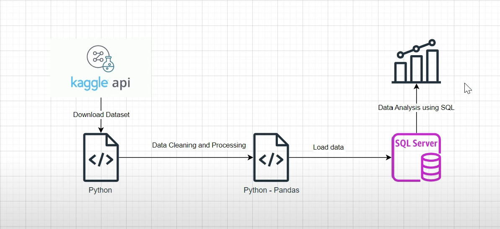

# 🛒 Retail Analysis

This project demonstrates an end-to-end **ETL (Extract, Transform, Load)** pipeline for retail order data using **Kaggle API**, **Python**, and **SQL Server**. The goal is to extract data from Kaggle, clean and process it using Python, load it into SQL Server, and perform insightful data analysis using SQL queries.

---

## 🧭 Project Flow



### ✅ Workflow Steps

1. **Extract**  
   - Use the **Kaggle API** to download a retail dataset.
   - Store the raw data locally in CSV format.

2. **Transform**  
   - Use **Python** and **Pandas** to:
     - Clean and preprocess the data.
     - Handle null values and correct data types.
     - Perform feature engineering if required.

3. **Load**  
   - Load the cleaned dataset into **SQL Server** using a Python-based connection (e.g., `pyodbc` or `sqlalchemy`).

4. **Analyze**  
   - Write and execute SQL queries to analyze key business metrics such as:
     - Total revenue
     - Top-selling products
     - Monthly sales trends
     - Customer purchase behavior

---

## 📁 Project Structure

📁 Retail_ETL_Analysis/
├── ETL_pipeline.ipynb # Jupyter Notebook for entire ETL process
├── ETL_pipeline_structure.png # Visual flowchart of the pipeline
├── README.md # Project documentation
├── SQLQuery.sql # SQL script for data analysis
└── orders.csv # Raw dataset (downloaded from Kaggle)


---

## 🛠️ Tools & Technologies

- **Python** (Jupyter Notebook)
- **Pandas**
- **Kaggle API**
- **SQL Server**
- **SQL**
- **pyodbc/sqlalchemy**

---

## 📊 Key Insights Derived

- Identify best-selling categories and products.
- Track monthly or regional sales trends.
- Detect outliers or unusual customer behavior.
- Suggest business strategies based on data-driven decisions.

---

## ▶️ Clone the repository

1. **Clone the repository:**
   ```bash
   git clone https://github.com/yourusername/Retail_ETL_Analysis.git
   cd Retail_ETL_Analysis


## ▶️ Getting Started

### Download the dataset using Kaggle API:

1. Place your `kaggle.json` API key file in the working directory.  
2. Use the following command in the notebook or terminal:
   ```bash
   kaggle datasets download -d <dataset-name>

## Run the notebook:

Open ETL_pipeline.ipynb in Jupyter Notebook or VS Code.

Follow the steps to extract, transform, and load the data.

## Run SQL Queries:

Open SQLQuery.sql in SQL Server Management Studio (SSMS) or another SQL environment.

Execute the queries to analyze the data.

## 👨‍💻 Author

Vrushabh Gillarkar


## 🙌 Contributions

Contributions are welcome!
Feel free to fork this repository, open issues, or submit pull requests to enhance the project.


